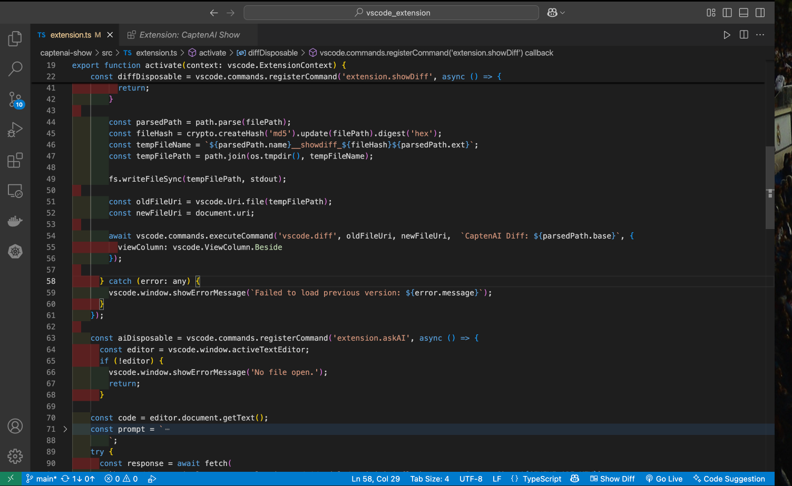
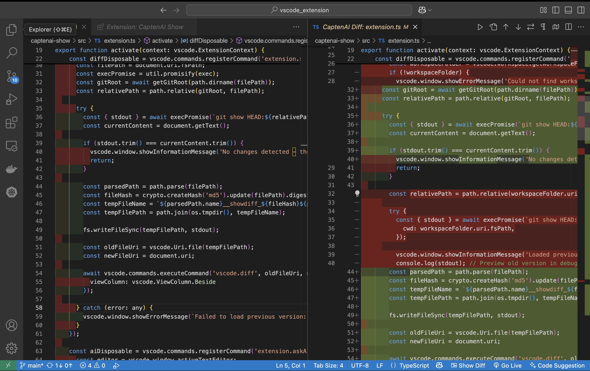
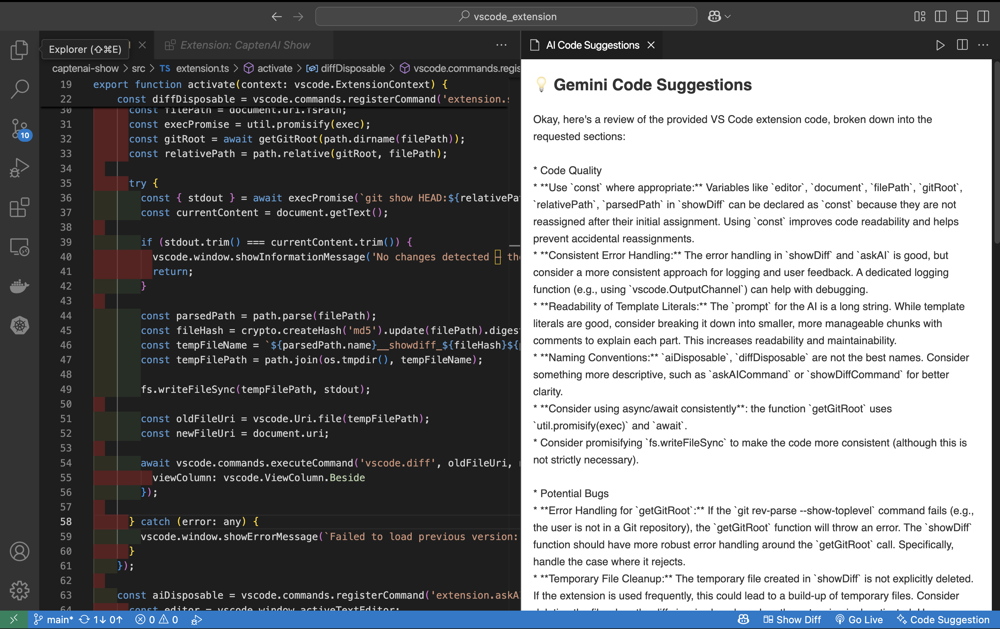

# 🚀 CaptenAI Show – VS Code Extension

**CaptenAI Show** is a lightweight developer tool that lets you:

- 🔍 Instantly compare your current file with the last Git commit
- 🤖 Get smart code review suggestions powered by **Gemini AI**
- ✨ Improve code quality with side-by-side diffs and AI insight

---

## 📸 Screenshots

> You Can See Button on the Bottom Right. One for See Update of Code and Another one for AI Suggestions.
  
> See Changes like that.
  
> AI suggest.
 
---

## 🛠 Features

| Feature | Description |
|--------|-------------|
| 🧠 **AI Suggestions** | Click "Code Suggestion" in the status bar to get AI-powered review of your code |
| 🔁 **Git Diff View** | One-click "Show Diff" to compare your current file with the latest Git commit |
| 🧼 **Smart Tab Handling** | Each diff opens in its own side-by-side view without cluttering your workspace |
| ⚡ **Fast & Minimal** | Built to keep your workflow fast and distraction-free |

---

## ⚙️ How to Use

1. Make sure your file is tracked in Git
2. Open the file in VS Code
3. Use the status bar or Command Palette:
   - `Show Diff` → see Git changes
   - `Code Suggestion` → get feedback from Gemini AI

---

## 🔐 Requirements

- Git must be installed and initialized in your project
- For AI suggestions, the extension uses the Gemini API behind the scenes

---

## 🔧 Coming Soon

- [ ] Custom API key configuration
- [ ] Inline AI suggestions
- [ ] Multi-file diff support

---

## 👨‍💻 Author

**Venkata Sai Ancha**  
🔗 [Publisher Profile](https://marketplace.visualstudio.com/publishers/venkatasaiancha)

---

## 📦 Install

Install from the VS Code Marketplace:

```bash
ext install venkatasaiancha.captenai-show
=======
# captenai-show README

This is the README for your extension "captenai-show". After writing up a brief description, we recommend including the following sections.

## Features

Describe specific features of your extension including screenshots of your extension in action. Image paths are relative to this README file.

For example if there is an image subfolder under your extension project workspace:

\!\[feature X\]\(images/feature-x.png\)

> Tip: Many popular extensions utilize animations. This is an excellent way to show off your extension! We recommend short, focused animations that are easy to follow.

## Requirements

If you have any requirements or dependencies, add a section describing those and how to install and configure them.

## Extension Settings

Include if your extension adds any VS Code settings through the `contributes.configuration` extension point.

For example:

This extension contributes the following settings:

* `myExtension.enable`: Enable/disable this extension.
* `myExtension.thing`: Set to `blah` to do something.

## Known Issues

Calling out known issues can help limit users opening duplicate issues against your extension.

## Release Notes

Users appreciate release notes as you update your extension.

### 1.0.0

Initial release of ...

### 1.0.1

Fixed issue #.

### 1.1.0

Added features X, Y, and Z.

---

## Following extension guidelines

Ensure that you've read through the extensions guidelines and follow the best practices for creating your extension.

* [Extension Guidelines](https://code.visualstudio.com/api/references/extension-guidelines)

## Working with Markdown

You can author your README using Visual Studio Code. Here are some useful editor keyboard shortcuts:

* Split the editor (`Cmd+\` on macOS or `Ctrl+\` on Windows and Linux).
* Toggle preview (`Shift+Cmd+V` on macOS or `Shift+Ctrl+V` on Windows and Linux).
* Press `Ctrl+Space` (Windows, Linux, macOS) to see a list of Markdown snippets.

## For more information

* [Visual Studio Code's Markdown Support](http://code.visualstudio.com/docs/languages/markdown)
* [Markdown Syntax Reference](https://help.github.com/articles/markdown-basics/)

**Enjoy!**
>>>>>>> 016ff0caacd31bae0caaa1d6af7fdff018ee8d27
